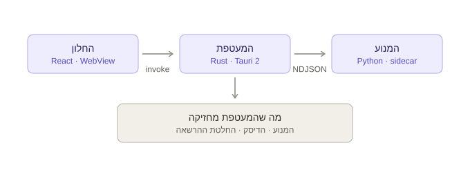
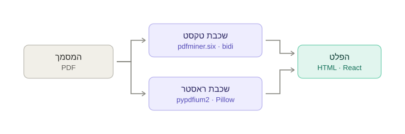
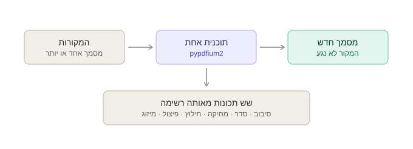

# מפה חזותית — התהליך והמבנים

התיקייה הזו היא **המפה**, לא ההנמקה. היא מראה איך הדברים בנויים ואיפה כל חלק יושב; **למה** הם בנויים כך נמצא במסמכים האחרים, וכל סעיף כאן מקשר אליהם במקום לחזור עליהם.

| מסמך | מה יש בו |
| --- | --- |
| README.md (כאן) | שלושה תרשימים: התהליכים, מסלול ההמרה, מסלול הסדנה |
| [structure.md](structure.md) | **מפת הקבצים** — כל קובץ בשלושת התהליכים ומה הוא עושה, והצורות שחוצות את הגבולות |
| [diagrams/](diagrams/) | התרשימים כקובצי SVG עצמאיים, לשימוש חוזר במצגת או במסמך |

מסמכים סמוכים: [architecture.md](../architecture.md) להנמקה · [roadmap.md](../roadmap.md) לסדר · [backlog.md](../backlog.md) למצב · [engine/README.md](../engine/README.md) להרצת המנוע.

---

## 1. שלושה תהליכים

החלון מדבר עם המעטפת דרך `invoke`, והמעטפת מדברת עם המנוע דרך **NDJSON על stdin/stdout** — שורת JSON אחת לכל הודעה.

**אין שרת HTTP מקומי, וזו הכרעה ולא עצלות.** פורט מאזין הוא ממצא בסריקת אבטחה אצל בדיוק הלקוח שקונה על ״שום דבר לא עוזב את המכונה״. צינורות אינם מאזינים לאיש.

**לחלון אין מערכת קבצים, אין רשת ואין shell.** הוא נוקב בשם של מה שהוא רוצה — `pick_document`, `output_dir`, `read_output` — והמעטפת מחליטה אם מותר. ההנמקה המלאה ב-[architecture.md §5](../architecture.md).

## 2. מסלול ההמרה

**כל עמוד נבנה משתי שכבות** — ראסטר שנושא כל ציור וקטורי ותמונה, וטקסט אמיתי וממוקם מעליו. זה מה שמאפשר לתוצאה להיראות זהה למקור ובכל זאת להישאר ניתנת לבחירה, לחיפוש ולעריכה.

**שלוש ספריות עיבוד, וזה מכוון:**

| ספרייה | תפקיד | רישיון |
| --- | --- | --- |
| `pypdfium2` | רינדור עמודים, ספירת גרפיקה, בנייה מחדש של מסמכים | Apache-2.0 / BSD-3 (PDFium) |
| `pdfminer.six` | שכבת הטקסט — תווים, פונטים וקואורדינטות | MIT |
| `Pillow` | כתיבת התמונות לדיסק | MIT-CMU |

**PyMuPDF נפסלה על רישיון** — AGPL-3.0 או תשלום ל-Artifex. מדידה של **78ms לעמוד** הראתה שאין כאן חסם ביצועים שמצדיק את זה; ההכרעה ב-[decisions.md](../decisions.md).

**`bidi` אינו ספרייה אלא פורט שלנו** של `src/core/bidi.js` מ-pdf.js, עם שתי טבלאות ה-256 מחולצות מכנית ולא מועתקות ביד. pdfminer מחזירה עברית **בסדר חזותי — כלומר הפוכה תו-אחר-תו**; בלי המודול הזה המוצר היה נראה עובד ומוציא ג'יבריש. זה הפריט היחיד בספרינט 3 שלא היה בתוכנית והחשוב שבו.

**הפלט נכתב לדיסק, והצינור נושא שמות בלבד.** 150 עמודים מרונדרים כ-base64 בתוך JSON הם עשרות מגה-בייט בערוץ שנועד לבקרה — ראה [architecture.md §2](../architecture.md).

## 3. מסלול הסדנה

**תוכנית היא רשימה שאומרת איזה עמוד מאיזה קובץ הולך לאן ואיך הוא מסובב.** סיבוב הוא שדה ברשומה, שינוי סדר הוא סדר הרשימה, מחיקה היא עמוד שלא ברשימה, חילוץ הוא רשימה קצרה, פיצול הוא כמה תוכניות, ומיזוג הוא תוכנית שנוקבת ביותר מקובץ אחד.

זו הצורה ש-pypdfium2 כבר מחזיקה — **ולכן שש התכונות הן פעולה אחת, ומקום אחד לדייק בו בסירובים במקום שישה.**

**הסירוב שמגן על מסמך:** תוכנית שהפלט שלה הוא גם קלט נדחית, וגם כשאותו קובץ מאויית אחרת. סדנה שכותבת בשקט על המסמך שמישהו גרר לתוכה השמידה את העותק היחיד שלו, ושום ביטול בממשק לא מגיע לקובץ שכבר איננו. דריסה מכוונת אפשרית, כי לפעמים זו הכוונה.

---

## עריכת התרשימים

קובצי ה-SVG עצמאיים: בלי גופנים חיצוניים, בלי סקריפטים, ועם `prefers-color-scheme` לכהה. אפשר לפתוח אותם בדפדפן, להטמיע במצגת או לערוך כטקסט — הקואורדינטות בתוכם ולא בכלי.

רוחב הבסיס הוא 680 יחידות. תרשים שגדל מעבר לחמישה תיבות עדיף לפצל לשניים מאשר לדחוס — תרשים צפוף מפסיק לתפקד כמפה, וזו כל מטרתו.
